# MemoSynth-Lite

> **A modular, LLM-powered memory system for agents, combining semantic search, timeline logging, graph relationships, and robust conflict handling.**

 
## 📖 Table of Contents

- [Project Overview](#project-overview)
- [Features](#features)
- [Async Features](#async)
- [Project Structure](#project-structure)
- [Technologies Used](#technologies)
- [Architecture](#architecture)
- [Memory Workflow](#memory-workflow)
- [Memory Schema](#memory-schema)
- [APIs](#apis)
- [Getting Started](#getting-started)
    - [Installation](#installation)
    - [Setup: Databases & Dependencies](#setup-databases--dependencies)
- [Demo Walkthrough](#demo-walkthrough)
    - [1. Environment Reset](#1-environment-reset)
    - [2. Memory Creation & Storage](#2-memory-creation--storage)
    - [3. Timeline Logging](#3-timeline-logging)
    - [4. Graph Relationships](#4-graph-relationships)
    - [5. Semantic Search](#5-semantic-search)
    - [6. Summarization (LLM)](#6-summarization-llm)
    - [7. Conflict Handling](#7-conflict-handling)
    - [8. Cross-Store Consistency](#8-cross-store-consistency)
    - [9. Performance Test](#9-performance-test)
- [Design Decisions & Best Practices](#design-decisions--best-practices)
- [Troubleshooting](#troubleshooting)
- [Future Improvements](#future-improvements)
- [Contact](#contact)

## 📝 Project Overview

MemoSynth-Lite is a modular, multi-store memory system for LLM agents.  
It enables agents to remember, retrieve, and summarize information over time—just like a human memory.  
This project demonstrates how to:
- Store and search memories semantically (Qdrant)
- Track memory evolution and conflicts (DuckDB)
- Extract and relate entities and events (Neo4j)
- Summarize, compare, and resolve memory conflicts using LLMs

**Motivation:**  
Modern LLM agents need a robust, multi-modal memory system to reason, plan, and act over long time horizons. MemoSynth-Lite is designed to be simple, extensible, and as a foundation for more advanced AI projects on similar lines.

## 🚀 Features

- **Semantic Search:** Retrieve memories by meaning, not just keywords.
- **Timeline Logging:** Chronologically track all memory events and updates.
- **Graph Relationships:** Model entities, relationships, and memory links.
- **LLM Summarization:** Summarize and reconcile memories with an LLM.
- **Conflict Handling:** Detect, log, and resolve version conflicts.
- **Cross-Store Consistency:** Ensure all memories are synchronized across stores.
- **Performance at Scale:** Efficient handling of batch inserts and queries.

## ⚡ Async Features

MemoSynth-Lite is **fully asynchronous** and leverages Python’s `async`/`await` syntax and the `asyncio` library for high-performance, concurrent operations.

- **All core APIs are async:**  
  Functions such as `write_and_sync_memory`, `query_memory`, `update_memory`, and graph/timeline operations are defined with `async def` and must be called with `await`.

- **Concurrent multi-store writes:**  
  When saving a memory, the system writes to Qdrant, DuckDB, and Neo4j concurrently using `asyncio.gather`, ensuring fast and reliable syncing across stores.

- **Async database clients:**  
  The project uses `AsyncQdrantClient` and `AsyncGraphDatabase` for non-blocking database access.

- **Scalable and responsive:**  
  Async design allows the system to handle multiple memory operations in parallel, making it suitable for agent workflows and future production scaling.

### How to use async APIs

**In a Jupyter notebook, prefix calls with `await`:**
```python
await write_and_sync_memory(memory)
results = await query_memory("What are Q2 risks?")
```

**In a script, use `asyncio.run()`:**
```python
import asyncio
asyncio.run(write_and_sync_memory(memory))
```

> **Note:**  
> If you are new to async Python, see the [asyncio documentation](https://docs.python.org/3/library/asyncio.html) for details and examples.

### Project Structure

```
memosynth-lite/
├── memosynth/
│   ├── memory_client.py
│   ├── vector_store.py
│   ├── timeline_store.py
│   ├── graph_store.py
│   ├── utility.py
├── notebook/
│   └── demo.ipynb
├── config/
│   └── sample_memory.json
├── test/
├── README.md
└── requirements.txt
```

| Module                | Purpose                                                      |
|-----------------------|-------------------------------------------------------------|
| `vector_store.py`     | Store/retrieve memories as embeddings in Qdrant (semantic)   |
| `timeline_store.py`   | Log memory events and conflicts in DuckDB (temporal)         |
| `graph_store.py`      | Model relationships/entities in Neo4j (relational/graph)     |
| `memory_client.py`    | High-level async APIs for all memory operations              |
| `utility.py`          | Helper functions (e.g., cosine similarity)                   |


## 🛠️ Technologies Used

| Tool         | Purpose                        |
|--------------|-------------------------------|
| Qdrant       | Vector DB (semantic search)    |
| DuckDB       | Timeline/log (temporal)        |
| Neo4j        | Graph DB (relationships)       |
| Ollama       | Local LLM server (summaries)   |
| SentenceTransformers | Embedding model        |
| Python Async | Non-blocking, scalable APIs    |

## 🏗️ Architecture

MemoSynth-Lite uses a three-store architecture:

| Component     | Technology         | Role                                      |
|---------------|--------------------|-------------------------------------------|
| Vector Store  | Qdrant             | Semantic search and embedding storage     |
| Timeline      | DuckDB             | Chronological log and conflict tracking   |
| Graph Store   | Neo4j              | Entity/event extraction and relationships |


## 🔄 Memory Workflow

1. **Memory Creation:**  
   - A new memory is created with metadata (ID, summary, tags, source, timestamps, etc.).

2. **Vector Storage (Qdrant):**  
   - The memory summary is embedded as a vector and stored in Qdrant for semantic search.

3. **Timeline Logging (DuckDB):**  
   - The memory is logged in DuckDB with a timestamp and version.
   - A primary key constraint prevents Duplicate IDs.

4. **Entity & Relationship Extraction (Neo4j):**  
   - Entities and relationships are extracted from the summary using an LLM.
   - Entities are stored as `Entity` nodes; relationships are created between them.
   - The memory is linked to its entities in the graph.

5. **Memory Update:**  
   - Updates increment the version if no conflict; conflicting updates are logged in DuckDB.

6. **Semantic Search:**  
   - Queries are embedded and used to retrieve the most relevant memories from Qdrant, re-ranked by recency and confidence.

7. **Summarization & Diff:**  
   - The LLM can summarize all memories.
   - Any two memories can be compared (`diff`) or reconciled (`resolve`) using vector similarity and LLM output.

8. **Cross-Store Consistency Check:**  
   - The system checks that all memories are present in Qdrant, DuckDB, and Neo4j.


## 📝 Memory Schema

A "memory" is a structured Python dict with rich metadata:

```python
example_memory = {
    "id": "m-001",
    "project": "demo_project",
    "agent": "doc_bot",
    "summary": "Client asked about margin drop in Q2.",
    "type": "insight",
    "tags": ["finance", "Q2", "risk"],
    "source": "Earnings_Report_Q2.pdf",
    "author": "doc_bot",
    "created_at": "2025-06-19",
    "version": 1,
    "confidence": 0.9,
    "visibility": "project",
    "sensitivity": "medium"
}
```

## 🛠️ APIs

MemoSynth-Lite exposes a set of core Python APIs for memory management.  
All APIs are async for scalability and can be called from your code or notebook.

### **Memory APIs**

- **`write_and_sync_memory(memory)`**  
  Save a memory to all stores (Qdrant, DuckDB, Neo4j) in parallel.

- **`query_memory(prompt, top_k=3)`**  
  Semantic search for memories matching a query. Returns top_k results, re-ranked by recency and confidence.

- **`update_memory(new_memory)`**  
  Update a memory by ID and version. Handles version conflicts and logs them.

- **`get_memory_by_id(memory_id)`**  
  Retrieve a memory by its unique ID from Qdrant.

### **Timeline APIs**

- **`log_memory(memory)`**  
  Log a memory in DuckDB timeline (skip if duplicate).

- **`log_conflict(new_memory, current_memory, conflict_type="version")`**  
  Log a version or content conflict to DuckDB.

### **Graph APIs**

- **`create_memory_node(memory)`**  
  Create or update a memory node in Neo4j.

- **`extract_entities_and_relationships(summary)`**  
  Use an LLM to extract entities and relationships from a memory summary.

- **`create_entity_nodes(nodes)`**  
  Create entity nodes in Neo4j from extracted entities.

- **`create_entity_relationships(edges)`**  
  Create relationships between entity nodes in Neo4j.

- **`link_memory_to_entities(memory_id, nodes)`**  
  Link a memory node to its extracted entities in Neo4j.

- **`find_related_memories(memory_id, max_hops=3)`**  
  Find related memories in the graph up to a certain number of hops.

### **Summarization & Diff APIs**

- **`summarize_memories(memories)`**  
  Summarize a list of memories using an LLM.

- **`diff(mem1, mem2)`**  
  Compare two memories for content similarity and show differences.

- **`resolve(mem1, mem2)`**  
  Use the LLM to reconcile conflicting memories and produce a unified summary.


## ⚡ Getting Started

### Installation

```bash
git clone https://github.com/yourusername/memosynth-lite.git
cd memosynth-lite
python -m venv venv
source venv/bin/activate  # On Windows: venv\Scripts\activate
pip install -r requirements.txt
```


### Setup: Databases & Dependencies

- **Qdrant (Vector DB):**
  ```bash
  docker run -p 6333:6333 qdrant/qdrant
  ```
- **Neo4j (Graph DB):**
  ```bash
  docker run -p 7474:7474 -p 7687:7687 -e NEO4J_AUTH=neo4j/test neo4j
  ```
- **DuckDB:** No setup needed; uses a local file.

- **Install Python dependencies:**
  ```
  pip install -r requirements.txt
  ```
  *(Make sure `json-repair` is included for robust LLM JSON parsing)*

## 🎬 Demo Walkthrough

The main demo is in `notebook/demo.ipynb`.  
**Each run resets all stores for reproducibility.**

### 1. Environment Reset

All data stores (Qdrant, Neo4j, DuckDB) are cleared at the start.

### 2. Memory Creation & Storage

Three sample memories are defined and written to all stores.

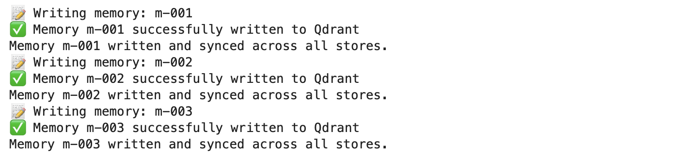


### 3. Timeline Logging

Memories are logged to DuckDB with timestamps and versioning.  
No duplicates are allowed.

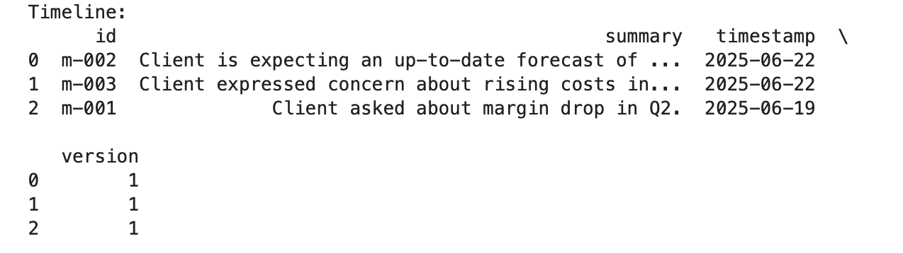


### 4. Graph Relationships

Entities and relationships are extracted from memory summaries and stored in Neo4j.

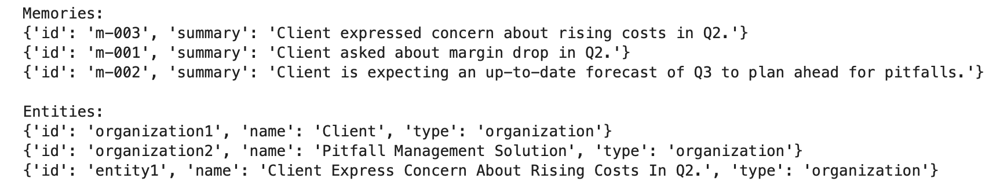
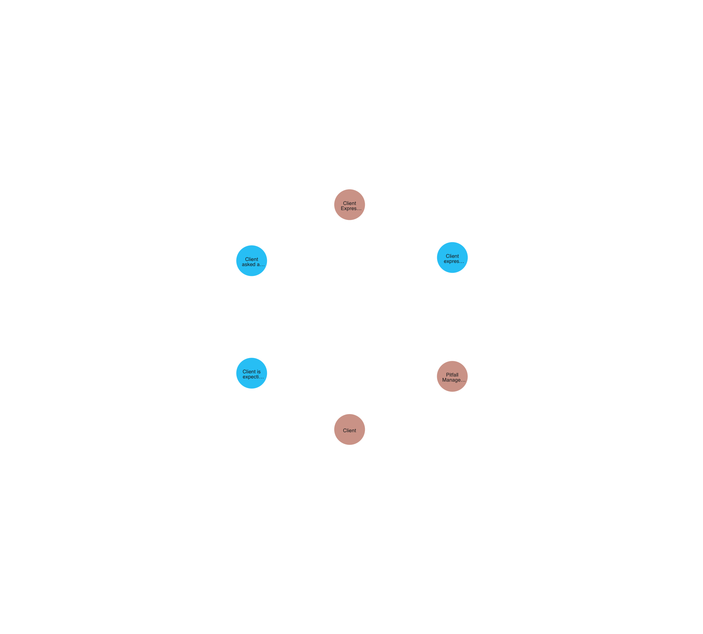
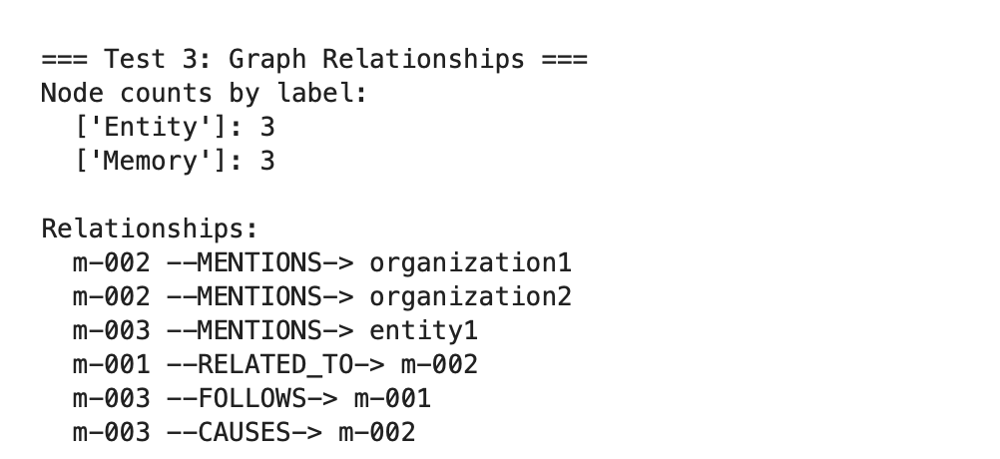
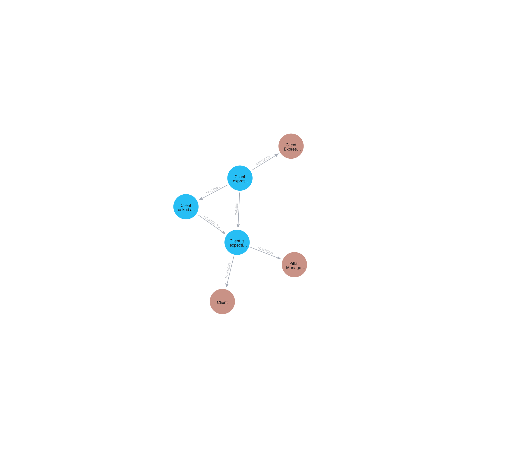

### 5. Semantic Search

Semantic queries return relevant memories, re-ranked by recency and confidence.

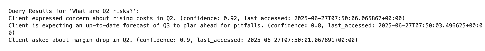


### 6. Summarization (LLM)

All memories are summarized using an LLM.  
**LLM output is automatically cleaned and repaired using the `json-repair` library to handle malformed JSON.**

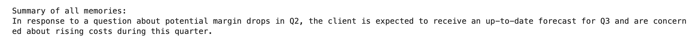


### 7. Diff and Resolve (LLM)

Given memories are checked for differences, and their difference is resolved and reconciled using an LLM.

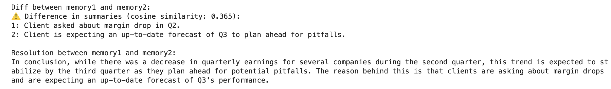


### 8. Conflict Handling

Memory updates with conflicting versions are detected and logged.  
Conflict logs are stored in DuckDB for auditability.

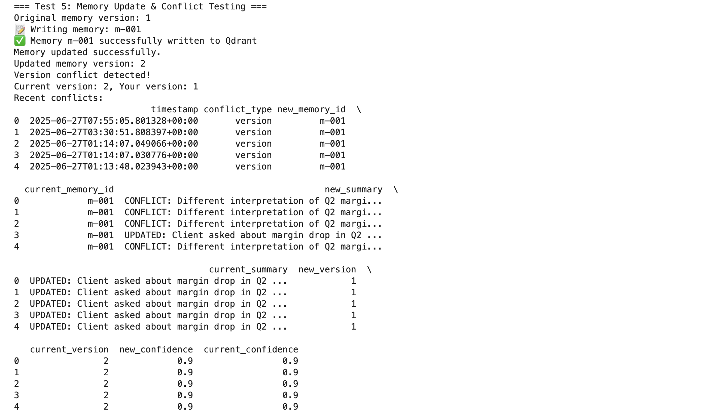


### 9. Cross-Store Consistency

Checks that all memories are present in Qdrant, DuckDB, and Neo4j.

### 10. Performance Test

Batch insertion and query timing are measured to demonstrate scalability.

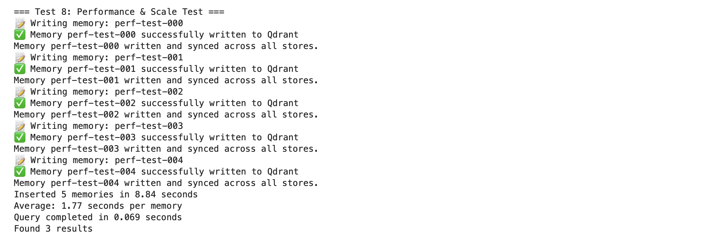


## 💡 Design Decisions & Best Practices

- **Three-Store Architecture:** Enables flexible, robust memory management for LLM agents ([see discussion](https://memgraph.com/blog/integrating-vector-and-graph-databases-gen-ai-llms)).
- **LLM JSON Cleaning:** Uses `json-repair` to robustly handle malformed LLM output.
- **Asynchronous Design:** All core APIs and database operations are fully asynchronous (`async`/`await`), enabling concurrent writes and reads to Qdrant, DuckDB, and Neo4j. This ensures non-blocking, scalable performance and smooth integration with agent workflows or high-throughput applications.
- **Conflict Handling:** Implements optimistic concurrency via versioning and detailed conflict logs.
- **Entity Segregation:** Distinguishes between `Memory` and `Entity` nodes in Neo4j for clarity.
- **Cross-Store Consistency:** Regular checks ensure no memory is lost or out of sync.


## 🛠️ Troubleshooting

- **Qdrant/Neo4j not running:** Ensure both Docker containers are up before running the notebook.
- **LLM JSON errors:** If you see "JSON extraction failed," check that `json-repair` is installed and imported.
- **Missing outputs:** Rerun all cells from top to bottom after resetting the state.

## 🚧 Future Improvements

- Add more advanced entity and relationship extraction.
- Integrate with real LLM APIs (OpenAI, HuggingFace, etc.).
- Add a user interface for non-technical users.
- Visualize the graph interactively in the notebook.
- Add authentication and access control.


## 🤝 Contact

**Author:** Rohit Khanna  
**Email:** 121rohit5khanna@gmail.com  
**GitHub:** rohit5khanna(https://github.com/rohit5khanna)


For questions or contributions, please open an issue or pull request!

